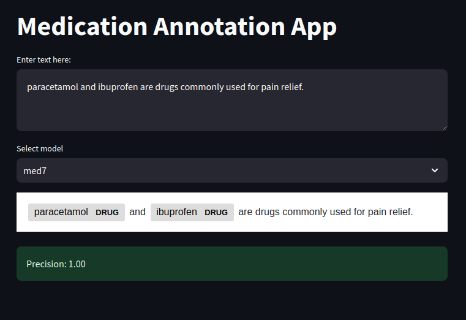
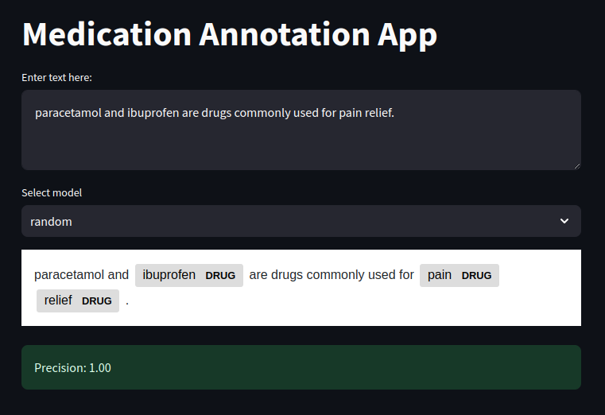
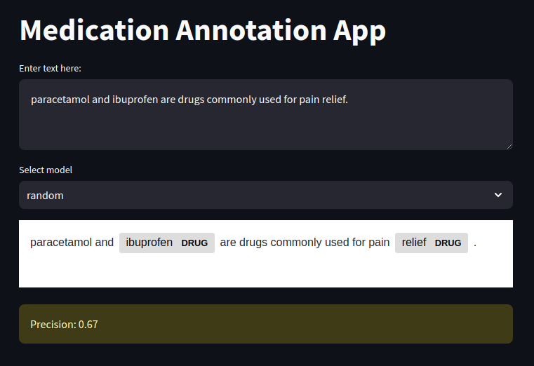
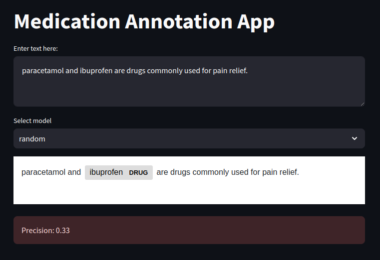
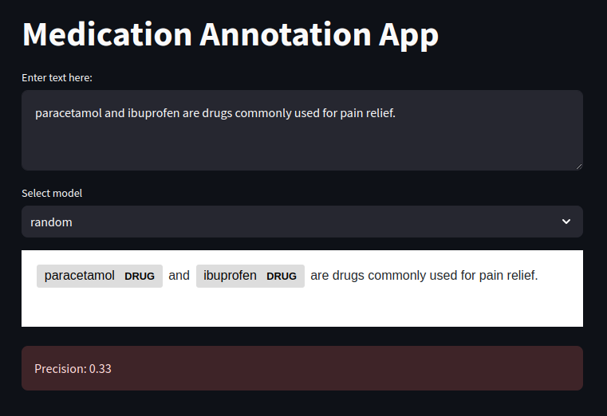

# Streammed: Annotate Medications in Text

Streammed is a web application based on Streamlit that enables the detection of medication names in
text using annotations. The web UI allows users to provide textual input and select the model to
use for generating the annotations, with 2 models currently supported:

* **Med7**: A named-entity recognition model for medical concepts, including medications
  [[1](https://www.sciencedirect.com/science/article/abs/pii/S0933365721000798),
  [2](https://github.com/kormilitzin/med7)].
* **Random**: A simple model that randomly selects a subset of words in the input text to annotate
  as medications. This model is used for demonstration purposes and to provide a baseline for
  comparison with the Med7 model.

As soon as the user provides the input text and selects the model (pressing Ctrl+Enter is necessary
to submit the text if the model remains unchanged), the application generates the annotations and
displays the rendered text including `DRUG` annotations for the identified medications.

The results for the 2 models and a sample input can be seen in the screenshots below. Note that
the outputs of the Random model are non deterministic, meaning that both the number of annotations
and the specific words annotated as medications may vary across runs with the same input.

<div style="display: flex; flex-wrap: wrap;">
  
  
</div>

## Precision Calculation

After the annotations are generated, the application starts tracking its precision for the provided
input, using the following formula:

$$
\text{Precision} = \frac{\text{True Positives}}{\text{True Positives + False Positives}}
$$

The precision is displayed in the UI and updated in real-time as the user adds (by selecting a word
in the rendered text) or removes (by hovering over an annotation in the rendered text and clicking
on the `x`) annotations. Removing an annotation generated by the model is considered a false
positive, resulting in a decrease in the precision value, while adding an annotation that was not
generated by the model is considered a false negative which does not affect the calculated value.

The precision is rendered in different colours based on the following ranges:

* **Green**: Precision >= 0.70
* **Yellow**: 0.5 <= Precision < 0.70
* **Red**: Precision < 0.5

Below we can see how the precision is affected as we remove the faulty annotations generated by the
Random model (i.e. "pain" followed by "relief") and add the missing correct one (i.e.
"paracetamol"). Note how adding the missing annotation doesn't affect the precision value which is
eventually equal to 0.33 (only 1 of the 3 generated annotations was actually correct):

<div style="display: flex; flex-wrap: wrap;">
  
  
  
</div>

## Running the Application

The application consists of a backend and a frontend that can be developed and run independently as
Docker containers. The backend is responsible for generating annotations using either random
selection or the Med7 model given an input text. It is implemented with FastAPI and exposes a
single API endpoint, `/predict`, that accepts a JSON payload containing the input text (i.e.
`text`) and the selected model (i.e. `model`), returning the annotations (`start` and `end` index
of the word to be annotated in the text, along with the `label` which in our case is always equal
to "DRUG") generated by the models in the response. The frontend, on the other hand, is a Streamlit
application that exposes a user-friendly interface for providing input text and selecting the model
to use for generating the annotations. The frontend sends the input text and the selected model to
the backend and displays the annotated text along with the precision value calculated based on the
user's interactions with the annotations.

To run the application, you will need Docker and Docker Compose installed. You can execute the
following command to start the application:

```sh
docker compose up
```

The above will build the backend and frontend images from source and start the corresponding
containers, making the application available at and make them available at http://localhost:8501.

## Testing the Application

To test the application, we provide a set of unit tests for the backend and frontend inside the
`tests` directory. These are run automatically as a GitHub Action as part of the configured CI
workflow, alongside the linting checks. The tests can also be run locally using the following
commands:

```sh
# Install Python dependencies
pip install -r requirements-dev.txt

# Run linting checks
ruff check .
black --check --verbose .

# Run backend and frontend tests
pytest
```
